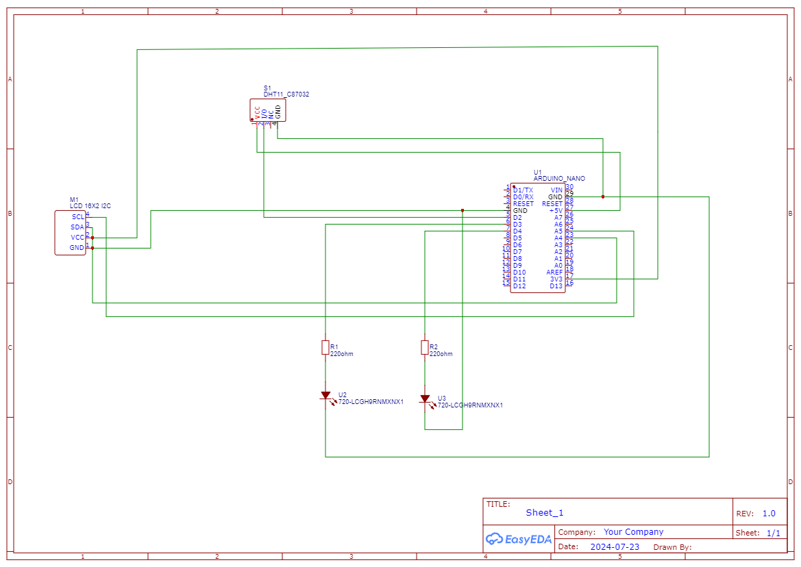

# KUBOMU-EDWIN-23-U-2223-GIM-PS

# Smart Monitoring Environment Systems (SEMs)

## Overview
The Smart Monitoring Environment Systems (SEMs) project is designed to monitor temperature and humidity using a DHT11 sensor. The system displays the readings on an I2C LCD and uses LED indicators (green and red) to signal if the environmental conditions exceed specified thresholds. The system alerts the user when the temperature exceeds 25°C or the humidity exceeds 60%.

## Hardware Components
- **Arduino Uno**
- **DHT11 Temperature and Humidity Sensor**
- **I2C LCD Display (16x2)**
- **Green LED**
- **Red LED**
- **Resistors (220Ω for LEDs)** (Optional when testing)
- **Breadboard and jumper wires**

## Software Requirements
- **Arduino IDE**
- **DHT Sensor Library** - [Download](https://github.com/adafruit/DHT-sensor-library)
- **LiquidCrystal_I2C Library** - [Download](https://github.com/johnrickman/LiquidCrystal_I2C)

## Circuit Diagram
q

## Setup Instructions
1. **Hardware Setup:**
   - **DHT11 Sensor:**
     - Connect VCC to 5V on the Arduino.
     - Connect GND to GND on the Arduino.
     - Connect the Data pin to digital pin 2 on the Arduino.
   - **I2C LCD Display:**
     - Connect SDA and SCL pins of the LCD to the corresponding SDA and SCL pins on the Arduino.
   - **LEDs:**
     - Connect the green LED anode to digital pin 3 and the red LED anode to digital pin 4 on the Arduino. Use 220Ω resistors in series with the LEDs to limit current.

2. **Software Setup:**
   - Download and install the required libraries in the Arduino IDE:
     - DHT Sensor Library
     - LiquidCrystal_I2C Library
   - Open the provided code file in the Arduino IDE.
   - Upload the code to the Arduino board.

## Usage
1. **Power the Arduino:**
   - Connect the Arduino to a power source (e.g., via USB or an external power supply).
   
2. **Monitor the Readings:**
   - The LCD will display the current temperature and humidity levels.
   
3. **LED Indicators:**
   - **Green LED:** Indicates normal conditions (temperature ≤ 25°C and humidity ≤ 60%).
   - **Red LED:** Indicates alert conditions (temperature > 25°C or humidity > 60%).

## Additional Notes
- Ensure the DHT11 sensor is properly connected and placed in an appropriate location for accurate readings.
- The temperature and humidity thresholds are defined in the code and can be adjusted as needed. Modify the `tempThreshold` and `humidThreshold` variables to set new limits.
- For accurate temperature and humidity readings, avoid placing the sensor near heat sources or in direct sunlight.
